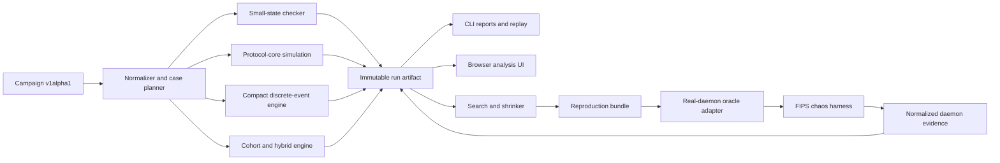

# Architecture direction

This document records the P0 defaults that make the roadmap implementable. The
detailed decisions and reversal triggers belong in the M0 ADRs.

The accepted decisions are recorded in:

- [ADR 0001 — pluggable protocol variants](adr/0001-pluggable-protocol-variants.md)
- [ADR 0002 — independent reference model first](adr/0002-independent-reference-model-first.md)
- [ADR 0003 — billion-node cohort/hybrid](adr/0003-billion-node-cohort-hybrid.md)
- [ADR 0004 — authenticated adversaries](adr/0004-authenticated-adversaries.md)
- [ADR 0005 — CLI and immutable artifacts before UI](adr/0005-cli-and-artifact-first.md)

## Product boundary

FIPS Wind Tunnel is a protocol simulator, stochastic/adversarial campaign
runner, causal cost ledger, protocol-variant comparator, real-implementation
oracle, and multi-resolution analysis system.

It is not an application sandbox, Docker farm, fleet manager, or graph editor.
The existing FIPS chaos harness is the highest-fidelity, lowest-scale backend.
It calibrates and validates the simulator; it does not own the canonical schema
or engine design.

## P0 decisions

| Fork | P0 default | Reversal point |
| --- | --- | --- |
| Protocol experimentation | B3: pluggable variants | M4 validates whether hooks remain deterministic and engine-independent. |
| Protocol source | Incremental A3: independent reference model first, then shared/production adapters | M0 proves the smallest upstream seam; M5 measures drift and shared-bug risk. |
| Billion-node meaning | C3: exact sampled regions inside cohort/analytical populations | M4 publishes calibration and resource evidence; individually distributed state remains post-P0. |
| Adversarial scope | D2: authenticated protocol-valid adversaries | M5 integrates malformed-wire fuzz results without merging the engines. |
| Product surface | E1 evolving toward E2: engine/CLI semantics first, artifact-driven UI in parallel after the artifact contract | M6 begins only after stable artifact/query fixtures exist. |

## Data flow



The artifact is the boundary between execution and analysis. The UI cannot
invent, reorder, or mutate experiment truth.

## Engine ladder

| Engine | Intended scale | Representation | Primary question |
| --- | ---: | --- | --- |
| Small-state checker | 2–20 nodes | Exhaustive states/interleavings | Can a race or invariant violation exist? |
| Protocol-core simulation | Hundreds to tens of thousands | Near-production state machines, virtual time, in-memory I/O | Does high-fidelity protocol state behave correctly? |
| Compact discrete-event | Thousands to millions | Individual nodes/edges, compressed semantic state | How do stochastic campaigns and attacks behave? |
| Cohort/analytical | Millions to billions | Populations and distributions | Which costs and boundaries are structural? |
| Hybrid | Large aggregate plus selected exact regions | Cohorts with embedded explicit subgraphs | Does an analytical anomaly survive exact instantiation? |
| Real-daemon oracle | Small networks | Actual binaries, crypto, codecs, sockets, transports | Does a minimized case reproduce in the implementation? |

A distributed individual-state engine remains possible after P0, but it is not
required to make an honest billion-node claim.

## Protocol model strategy

The initial reference model is independent and normalized around deterministic
inputs/outputs. It optimizes for instrumentation, compact state, search, and
shrinking.

FIPS commit
[`80c956a`](https://github.com/jmcorgan/fips/tree/80c956a6fdb85dde1450969a21891c1158e43267)
already contains sans-I/O modules under `src/proto`, with core/state/wire/limits
separation for several subsystems and an injected monotonic-time seam. The pure
cores are currently crate-private while many wire and state types are re-exported.

The incremental dual-model path is:

1. Implement a versioned independent reference model.
2. Use production codecs or generated conformance fixtures for exact bytes.
3. Expose the smallest deterministic upstream seam that proves useful.
4. Normalize and compare independent and shared-core transitions.
5. Validate minimized cases against real daemons.

Shared code improves fidelity but cannot be its own oracle. The independent
model and real daemon remain necessary because a shared bug can pass a
shared-core comparison.

## Causal cost ledger

Every initiating event receives a stable causal ID. Work descended from it is
tracked through semantic transitions, message lifecycle, compute, state, queue,
transport, and useful delivery.

```text
input event
  → transition requested
  → transition performed
  → message constructed / superseded / coalesced
  → signed / serialized / queued / transmitted / delivered
  → follow-on cache, lookup, session, retry, and payload effects
```

The ledger must support exact reconciliation at represented layers and explicit
bounds or uncertainty at analytical layers. A successful wire debounce must not
hide repeated local signing, allocation, or state churn.

## Bloom fidelity

The representation is chosen explicitly per run:

- `exact-bits` for correctness and daemon-sized comparisons;
- `sparse-bits` before occupancy makes sparse storage counterproductive;
- `occupancy` for seeded probabilistic individual-node runs;
- `cohort-fpr` for population-level analysis;
- `sampled-exact` for exact anomaly regions inside aggregate networks.

Cross-mode calibration is part of the evidence, not an implementation detail.

## Real-daemon boundary

The oracle adapter imports supported chaos YAML, compiles representable campaign
subsets back to the current harness, captures binary/image/commit/config/host
provenance, ingests control-socket and log evidence, and normalizes observations
for differential reports.

Unsupported simulator semantics must produce representability errors. They must
not silently disappear in a daemon run.
